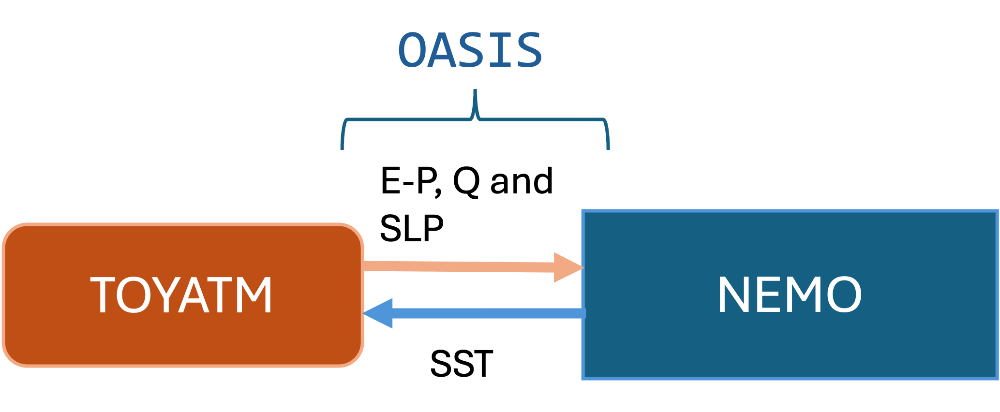
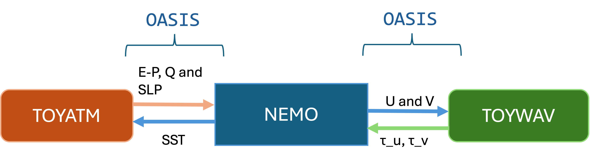

# CPL OASIS demonstrator
This demonstrator aims to show how to run NEMO coupled to an atmosphere model, and to both an atmosphere and wave model. It is written to be compatible with NEMO v5.0.1 with XIOS3. It is a simple test case, but should act as the basis for more complex configurations. 

## Getting started
### Prerequisites

You will need to have an installation of [OASIS3-MCT](https://oasis.cerfacs.fr/wp-content/uploads/sites/114/2021/12/GLOBC_TR_oasis3mct_UserGuide_4.0_final_122021.pdf)  and a version of XIOS3 which has been compiled for OASIS. 

To compile XIOS3 for use with OASIS, do 

```
./make_xios --prod --use_oasis oasis3_mct --arch your_Arch_file --full --job 8
```

## Download and compile NEMO

This demonstrator is for NEMO v5.0.1.

To install this version, do 

```
git clone --branch 5.0.1 https://forge.nemo-ocean.eu/nemo/nemo.git nemo_5.0.1
```
### Clone this Demonstrator repository
This demonstrator includes an updated version of the CPL_OASIS test case, so next we will need to clone the repository.

```
git clone https://github.com/alwalsh3/CPL_OASIS_demo.git
```

### Copy new CPL_OASIS and compile
Navigate to the location of the test configuration CPL_OASIS:

```
cd /nemo_5.0.1/tests/
```
Then, from the clone of this repository that you have made, copy the CPL_OASIS directory to `/nemo_5.0.1/tests/` (overwriting the version there by default).

We are now ready to compile the CPL_OASIS test case. To do this, navigate to the NEMO home directory `/nemo_5.0.1/` (the one which contains `makenemo`), and run the command

```
./makenemo -a CPL_OASIS -n MYCPL_OASIS -m your_Arch_file -j 8
```
**NOTE:** You must ensure you have the same software enivornment loaded when you compile NEMO as you did when you compiled XIOS3 and OASIS

We have included example Arch files from two HPCs in `/CPL_OASIS_demo/support_files/`.

## Download forcing data
We need to get the ORCA2 ancilliary files which can be downloaded from here:

```
wget "https://gws-access.jasmin.ac.uk/public/nemo/sette_inputs/r5.0.0/ORCA2_ICE_v5.0.0.tar.gz"
```

Unzip the directory, and make a note of the location you have saved it (this will need to be added to the runscript later).


## TOYATM and TOYWAV compilation

This test case uses a toy atmosphere model (and later toy wave model also) to couple to NEMO. We will need to compile the latest version of these toy models. First, copy the TOYATM and TOYWAV directories from this repository that you have cloned to `/nemo_5.0.1/tools/`. This will overwrite the default TOYATM, and add TOYWAV. 

Now we compile them. Ensure you are in the `/nemo_5.0.1/tools/` and run:

```
./maketools -n TOYATM -m your_Arch_file
```

```
./maketools -n TOYWAV -m your_Arch_file
```

**NOTE:** You must ensure you have the same software enivornment loaded when you compile TOYATM and TOYWAV as for when you compiled NEMO. 


# Test case 1: Couple NEMO to TOYATM

Explanation....

<p align="center">
  
</p>

The updated CPL_OASIS test case that you have compiled is now almost ready to run. One additional step is to add a job script and update for your machine. Navigate to `nemo_5.0.1/tests/MYCPL_OASIS/EXP00/` and copy an example job script from this repository. We have included examples from a SLURM and PBS based HPC. To copy (using the PBS example),

```
cp CPL_OASIS_demo/support_files/job_run_CPL_OASIS_ATM_UKMO_PBS 
```

(Follow the directory structure in your local machine)

There are a number of changes you will need to make to set up the job script. Update the paths of CONFIG_DIR, WORK, DATADIR, TOYATM_DIR, XIOS_DIR to the paths on your system.

It should now be ready to submit, e.g. for PBS do

```
qsub job_run_CPL_OASIS_ATM_UKMO_PBS
```
or for SLURM, 

```
sbatch job_run_CPL_OASIS_ATM_NOC_SLURM
```

The output should be located in the WORK directory you specified in the job script (`$WORK/OUT/CPLTESTCASE/$XXD`). You can check if the model ran to completion by checking

```
cat time.step
```
and it should say `160` - which is the total length of this test run.

There should also be a number of netCDF files produced, one for each NEMO grid, e.g. `ORCA2_5d_00010101_00010110_grid_T.nc`. 

Some output files will be generated by OASIS these are generated for each variables exchanged between the component models and appended at every coupling time step. For each variable two corresponding files are generated in the native grids of the component models. 

We can supress it by editing the namcouple file in `TOYATM/EXP/namcouple` by replacing every EXPOUT calls with EXPORTED. In a real experiment these files are a good source for debuging and ensuring the quality of data exchanged. 


# Test case 2: Couple NEMO to TOYATM and TOYWAV

Explanation...

<p align="center">
  
</p>

We can now try coupling NEMO to two different models: a toy atmosphere (`TOYATM`) and a toy wave model (`TOYWAV`). We will use the same test configuration `CPL_OASIS`, and create a new configuration `MYCPL_OASIS_ATMWAV` for this example:

```
./makenemo -a CPL_OASIS -n MYCPL_OASIS_ATMWAV -m your_Arch_file -j 8
```

Before submitting our job, we need to make some changes. Navigate to the configuration directory `nemo_5.0.1/tests/MYCPL_OASIS_ATMWAV/EXP00/`. From the support files from this repository, copy the namelist `namlelist_cfg_ATMWAV` and rename to just `namelist_cfg` (since this is what will be picked up by NEMO). 

```
cp CPL_OASIS_demo/support_files/namelist_cfg_ATMWAV .
mv namelist_cfg_ATMWAV namelist_cfg
```

As before, we also need to copy a job script. For example,

```
cp CPL_OASIS_demo/support_files/job_run_CPL_OASIS_ATMWAV_UKMO_PBS .
```
Note that this is different to the job script used in Test case 1. Update the job script for your machine, and submit.

# Understanding coupling with OASIS

Now that you have run the two coupling demonstrators, explore what is different in the coupling setups when two or three models are involved. Explore the differences 
in the following files to understand what is needed when multiple models are coupled to NEMO. 

* Explore the difference in TOYATM/EXP/namcouple and TOYWAV/EXP/namcouple (Section 3 of the [OASIS-MCT](https://oasis.cerfacs.fr/wp-content/uploads/sites/114/2021/12/GLOBC_TR_oasis3mct_UserGuide_4.0_final_122021.pdf) documentation explains in detail the OASIS configuration file namcouple)
* Explore the difference in MYCPL_OASIS/EXP00/namelist_cfg and MYCPL_OASIS_ATMWAV/EXP00/namelist_cfg


# Debugging tips

* From testing, we found that different machines may be sensitive to the order of the executables in the run command (e.g. `mpiexec`) in the job script. If NEMO hangs when you submit your job, try reordering the XIOS3 executable and try again. 

